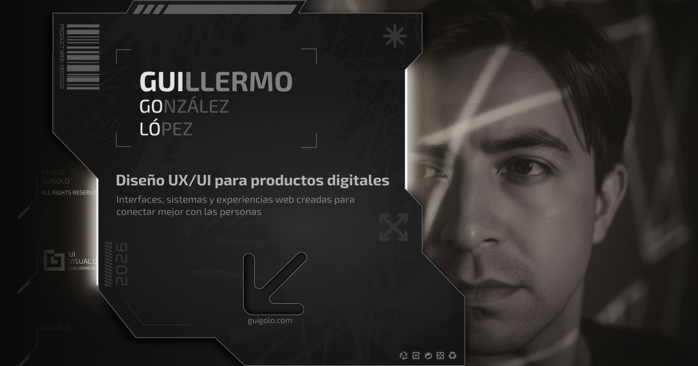

# Guigolo — Diseño UX/UI 

Portafolio personal de **Guillermo González López**.  
Diseño interfaces claras, sensibles y estratégicas para productos digitales reales.

> La conexión real empieza donde termina lo estético.

---

## 🖤 Preview



> Portafolio en producción:  
👉 https://guigolo.com/go/github

---

## 🧠 ¿Qué es este proyecto?

**Guigolo** es mi portafolio personal como diseñador UX/UI.  
No es un template, no es un experimento aislado y no es un sitio genérico.

Es una **landing viva**, diseñada para comunicar:
- quién soy,
- cómo pienso,
- cómo diseño,
- y por qué mi trabajo conecta emoción con negocio.

Está pensada tanto para **reclutadores**, **clientes**, como para **personas curiosas por el diseño bien hecho**.

---

## 🎯 Objetivo

Crear un portafolio que:

- Priorice **claridad y funcionalidad**
- Explique mi proceso sin abrumar
- Se sienta humano, no corporativo
- Sea técnicamente sólido y escalable
- Destaque entre el 99% de portafolios genéricos

Este proyecto no busca impresionar con ruido, sino **convencer con criterio**.

---

## 🧬 Filosofía de diseño

- UX consciente, no decorativo  
- Diseño emocional sin caer en lo cursi  
- Cyberpunk suave: tecnología sensible, no agresiva  
- Micro-detalles que acompañan, no estorban  
- Decisiones visuales alineadas a negocio  

Diseñar bien no es solo verse bonito.  
Es **hacer que algo se sienta correcto**.

---

## ⚙️ Tecnologías usadas

- **Next.js (App Router)** — Framework principal
- **React** — Arquitectura por componentes
- **Tailwind CSS** — Styling con tokens y control fino por breakpoints
- **SVGs optimizados** — Íconos y elementos blueprint escalables
- **Vercel** — Hosting, deploy continuo y performance
- **Formspree** — Manejo de formularios sin backend

---

## ✨ Features clave

- Hero con degradado animado sutil
- Navbar blueprint por capas (SVG)
- Layout responsive pensado desde mobile
- Componentes reutilizables
- Sistema de chips, cards y módulos
- SEO y Open Graph configurados
- Animaciones suaves y performantes
- Formularios funcionales y claros

---

## 🗂️ Estructura del proyecto

```txt
/app
  ├─ layout.tsx
  ├─ page.tsx
/components
  ├─ Navbar
  ├─ Hero
  ├─ About
  ├─ Projects
  └─ UI components
/public
  └─ brand
     ├─ icons
     ├─ nav
     └─ hero
/styles
  └─ globals.css
